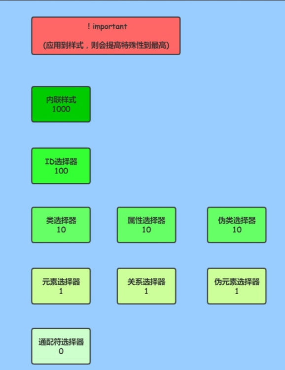

v-bind:单向绑定解析表达式,可简写为:xx
v-model:双向数据绑定
v-for:遍历数组/对象/字符串
v-on:绑定事件监听，可简写为@
v-if:条件渲染(动态控制节点是否存存在)
v-else:条件渲染(动态控制节点是否存存在)
v-show:条件渲染(动态控制节点是否展示)
v-text:解析内容的文本
v-html:解析包含html的文本（不要在用户输入的部分使用，可能会遭到xss攻击）
v-cloak：没有值，本质是个特殊属性，Vue创建接管容器后，会删掉这个属性，解决网络阻塞导致一些cdn等引入问题
v-once:只会读一次，初次动态渲染后就变为静态了
v-pre：跳过其所在的节点的编译过程，优化速度（有些静态内容不需要vue解析）

css选择器优先级：
                